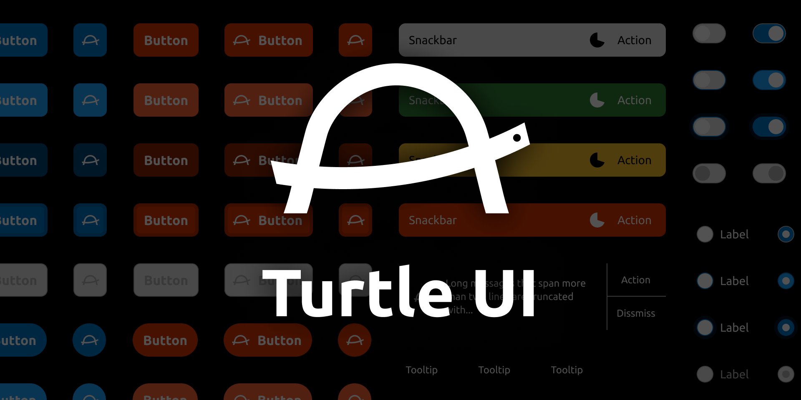

This repository contains a source code for the Web Component implementation of [**Turtle UI**][design file], designed by [**@oathkite**](https://github.com/oathkite).

- [Design specification][design file]
- [Documentation](https://pocka.github.io/TurtleUI)

[design file]: https://www.figma.com/community/file/990997715540889664

## How to contribute

See [CONTRIBUTING.md](./CONTRIBUTING.md).
